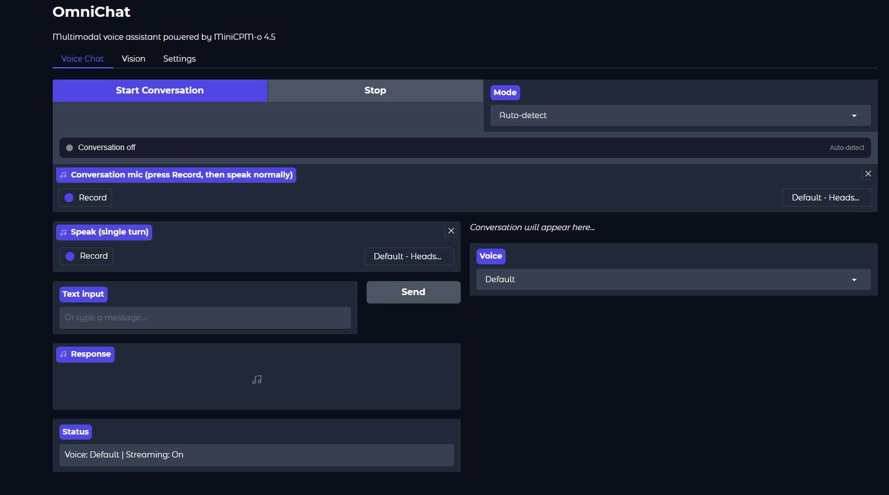

# OmniChat

Multimodal voice assistant powered by [MiniCPM-o 4.5](https://huggingface.co/openbmb/MiniCPM-o-4_5). Talk to it, show it images, feed it video — it sees, hears, and speaks.

Two frontends share the same model and tools:

| Frontend | Launch | Latency | Best For |
|----------|--------|---------|----------|
| **Gradio Web UI** | `launch.bat` / `python main.py` | ~4-8s (HLS streaming) | Sharing, demos, remote access |
| **PySide6 Desktop** | `launch_rt.bat` / `python rt_main.py` | ~1.5-2s (direct PCM) | Daily use, low-latency conversations |

Only one can run at a time (single GPU). See [README_RT.md](README_RT.md) for the desktop app, or [SETUP.md](SETUP.md) for full build instructions.

---



*This README covers the Gradio web UI. For the desktop app, see [README_RT.md](README_RT.md). For step-by-step setup, see [SETUP.md](SETUP.md).*

## What It Does

- **Voice chat** — speak into your mic, get a spoken response
- **Voice cloning** — type "use Morgan Freeman's voice" and it does
- **Vision** — describe images, extract text from documents (OCR), analyze video
- **Streaming** — audio starts playing while the model is still generating
- **Continuous conversation** — hands-free back-and-forth with VAD, anti-vox echo suppression, and barge-in
- **Web UI** — three-tab Gradio interface for chat, vision, and settings

## Requirements

| Component | Minimum |
|-----------|---------|
| GPU | NVIDIA with 10+ GB VRAM (quantized) or 20+ GB (full precision) |
| CUDA | 12.x with PyTorch 2.3+ |
| Python | 3.12+ |
| OS | Windows (tested), Linux (should work) |

### Quantization

The model loads in bf16 by default (~19 GB VRAM). Quantization makes it accessible on smaller GPUs:

| Mode | VRAM | Method | Quality Impact |
|------|------|--------|---------------|
| `none` (default) | ~19 GB | bf16 full precision | Baseline |
| `int8` | ~10-12 GB | bitsandbytes 8-bit | [Essentially lossless](https://arxiv.org/html/2411.02355v3) (~0.04% degradation) |
| `int4` | ~11 GB | bitsandbytes NF4 | [~1.6% degradation](https://research.aimultiple.com/llm-quantization/) on text benchmarks |

```bash
# Full precision (default, needs 20+ GB VRAM)
launch.bat

# INT8 quantization (recommended for 12-20 GB GPUs)
launch.bat --quantization int8

# INT4 quantization (for GPUs under 12 GB)
launch.bat --quantization int4
```

Or set it permanently in `args/settings.yaml`:
```yaml
model:
  quantization: "int8"   # none, int8, int4
```

Both INT8 and INT4 use [bitsandbytes](https://github.com/bitsandbytes-foundation/bitsandbytes) on the same base model checkpoint — no separate download needed. INT4 uses NF4 (Normal Float 4) with double quantization.

**Research:** ["Give Me BF16 or Give Me Death?"](https://arxiv.org/html/2411.02355v3) (ACL 2025) found FP8/INT8 quantization essentially lossless across the Llama-3.1 family. See also [LLM Quantization: BF16 vs FP8 vs INT4](https://research.aimultiple.com/llm-quantization/) for broader benchmarks.

**Important caveats:**
- All published quality benchmarks are **text-only** (MMLU-Pro, etc.). Audio and speech generation quality under quantization has not been formally benchmarked by anyone. Audio tokens represent spectral features where numerical errors may compound audibly.
- **INT8/INT4:** Only the LLM transformer layers are quantized. Audio (apm, tts), vision (vpm), resampler, and projection modules are kept in bf16 to preserve multimodal quality. If audio output sounds garbled under quantization, fall back to bf16.
- **If in doubt, use bf16.** Quantization is a VRAM tradeoff, not a free lunch. Text chat will work fine in all modes; audio/speech is the risk area.

## Quick Start

See [SETUP.md](SETUP.md) for detailed step-by-step instructions including prerequisites, CUDA setup, and troubleshooting.

```bash
cd OmniChat

# 1. Setup (creates venv, installs deps, checks CUDA)
python setup.py

# 2. Launch the web UI
launch.bat
# Opens http://localhost:7860

# 3. Or run the live demo
demo.bat --stream
```

## Features

### Voice Chat

Record audio through your microphone or type text. The model responds with both text and speech at 24 kHz.

**Voice commands** are detected from typed text input (not spoken). Type any of these in the text box:

- "Switch to Morgan Freeman's voice"
- "Use Obama's voice"
- "Go back to the default voice"

Fuzzy matching finds the closest voice name, so "freeman" or "morgan" both work. You can also switch voices from the dropdown selector. The next spoken audio will use the new voice.

### Voice Cloning

The model clones voices natively — no external TTS engine needed. Use 3–5 second clips for best results; longer clips are truncated to the configured sample length (default 5s) before sending to the model. Shorter clips reduce parroting of the sample's spoken content.

**Accepted formats** — you don't need to pre-convert anything:

| Source | Formats | How |
|--------|---------|-----|
| **Audio file** | WAV, MP3, OGG, FLAC, M4A, and anything [librosa](https://librosa.org/) can decode | Upload via Settings tab or drop into voices directory |
| **Video file** | MP4, AVI, MOV, MKV, WebM, and anything [ffmpeg](https://ffmpeg.org/) can decode | Settings tab > "From Video Clip" — set start time and duration |
| **Microphone** | Direct recording | Settings tab > record from mic |

All inputs are automatically converted to 16 kHz mono WAV (resampled, mixed to mono, saved as WAV). No manual conversion needed.

Voice samples are **not included in the repo** (copyright concerns). Supply your own via:
- The `audio.voices_dir` setting in `args/settings.yaml` (default: `voices/`)
- The `--voices-dir /path/to/voices` command-line flag
- Upload through the Settings tab (audio file, video clip, or mic recording)

### Vision

**Image description** — upload any image and ask questions about it. The model identifies objects, reads text, and describes spatial relationships.

**Document OCR** — upload a document image. The system auto-detects whether the output is a table (pipe/tab-delimited), markdown, or plain text, and can save results as Excel, Markdown, or text files.

**Video analysis** — upload a video file. The model processes both the visual frames and the audio track together.

### Continuous Conversation

Three interaction modes for hands-free voice chat:

| Mode | How It Works |
|------|-------------|
| **Auto-detect** (default) | Silero-VAD listens continuously. When speech is detected, it records. When silence exceeds the threshold (~1.5s), it sends to the model. Most natural for conversation. |
| **Push-to-talk** | Hold a button to record, release to send. Most reliable, no false triggers. |
| **Click per turn** | Mic records after model responds, click to send. Explicit but simple. |

The conversation state machine has six states displayed in real-time with color-coded indicators:

- **Listening** (green, pulsing) — mic active, waiting for speech
- **You're speaking** (blue) — VAD detected speech, buffering audio
- **Thinking** (yellow) — speech ended, model processing
- **Responding** (purple) — model streaming audio response
- **Ready** (orange) — response done, about to resume listening

Click "Start Conversation" then "Record" on the conversation mic to begin. The model will listen, respond, and automatically resume listening.

### Streaming Audio

Two generation paths:

| Path | Use Case |
|------|----------|
| `chat()` | File-based, blocking — generates complete audio, then plays |
| `chat_streaming_with_playback()` | Real-time — audio starts playing as the first chunk arrives (~1–2s) |

The streaming player uses a queue-based callback architecture with `sounddevice`. Each chunk is RMS-normalized before hitting the speaker so volume stays consistent in real time.

### Gradio Patches

Gradio 6.6.0's `gr.Audio(streaming=True)` has four bugs that break multi-turn streaming audio. OmniChat patches these locally in `.venv/Lib/site-packages/gradio/` at install time:

1. **Frontend `stream_active` flag never resets** — HLS player isn't recreated between streams, so only the first turn plays audio. Fix: destroy and recreate the HLS instance for each new stream URL.
2. **Frontend `stream_ended` not reset** — same-URL streams blocked after first playback finishes. Fix: `ended` event on the audio element resets the flags.
3. **Backend `id()` reuse** — `run=id(iterator)` reuses Python memory addresses after GC, confusing the stream registry. Fix: detect ended `MediaStream` and create a fresh one.
4. **Backend `KeyError` on barge-in** — `end_stream()` crashes if the generator is interrupted before any audio is yielded. Fix: guard with `output_id in stream_run`.

A fix for HLS buffer stalls (`maxBufferLength` too aggressive) is also applied. These patches are applied to the local venv only. A fork with the fixes is at `ericleigh007/gradio` (branch `fix/streaming-audio-multi-turn`).

**This is the main reason the desktop app exists** — the PySide6 client bypasses Gradio's HLS pipeline entirely, eliminating both the latency and the need for patches.

### Audio Leveling

All output goes through a two-stage dynamics pipeline:

1. **Static RMS normalization** — brings all audio to a consistent target level regardless of source (default voice, cloned voice, etc.)
2. **Windowed RMS compressor** — smooths dynamics with configurable attack/release envelope, soft-knee compression curve, makeup gain, and peak limiter

Voice reference inputs get their own static normalizer tuned for short clips.

Every parameter is exposed in [`args/settings.yaml`](args/settings.yaml):

```yaml
audio:
  leveling:
    enabled: true
    output_threshold_dbfs: -20.0   # compression threshold (podcast level)
    output_ratio: 3.0              # 3:1 gentle compression
    output_attack_ms: 15.0         # gain reduction speed
    output_release_ms: 150.0       # gain recovery speed
    output_knee_db: 6.0            # soft knee width
    output_makeup_db: 4.0          # post-compression boost
    peak_ceiling_dbfs: -0.1        # hard limiter ceiling
```

## Web UI

Launch with `launch.bat` (or `python main.py`). Opens at `http://localhost:7860`. Three tabs:

**Voice Chat** — Two sections: continuous conversation (top) with start/stop and mode selector, and single-turn (bottom) with mic input, text box, streaming audio output, chat history (last 20 turns with live partial updates), and voice selector dropdown. A color-coded animated state indicator shows the current conversation state in real-time.

**Vision** — Two subtabs: Image (upload or webcam, optional document/OCR mode) and Video (upload MP4/AVI/MOV). Shared output panel with format auto-detection (markdown, table, plain text) and save to Markdown, Text, or Excel.

**Settings** — Inference controls (temperature, max tokens, repetition penalty, voice sample length), conversation mode tuning (silence threshold, VAD sensitivity, echo cooldown, anti-vox boost, barge-in toggle), and voice management (upload from mic/file, extract from video clip with start time and duration, delete).

## Live Demo

The demo is a scripted 7-act showcase that exercises every capability:

| Act | Capability | What Happens |
|-----|-----------|--------------|
| 1 | Text Chat | Three math questions, echo detection |
| 2 | Text-to-Speech | Fun fact generation with audio |
| 3 | Voice Cloning | Same prompt in Morgan Freeman's voice |
| 4 | Vision — Image | Describes a generated geometric scene |
| 5 | Vision — OCR | Extracts text from a generated invoice |
| 6 | Multi-Turn | Five-question conversation with streaming |
| 7 | Samantha Voice | Two science questions in Scarlett Johansson's "Her" voice |

```bash
demo.bat                          # file-based audio
demo.bat --stream                 # real-time streaming
demo.bat --headless               # no audio/display (CI mode)
demo.bat --acts 1,3,5             # run specific acts
demo.bat --strict                 # exit on first failure
demo.bat --quantization int8      # run with quantized model
```

The demo also serves as a regression test via `pytest tests/test_demo_smoke.py`.

## Quantization Benchmarks

Compare audio quality across bf16, int8, and int4 with spectrograms and metrics:

```bash
benchmarks\benchmark.bat                         # run all three quant levels
benchmarks\benchmark.bat --quants none,int8      # compare specific levels
benchmarks\benchmark.bat --voice-ref voices\samantha_johansson.wav  # with voice cloning
```

Each quant level runs in a separate subprocess (model singleton can't reload). Outputs raw pre-leveling audio, mel spectrograms, and a markdown report with RMS, spectral centroid, bandwidth, and zero-crossing rate comparisons.

## Configuration

All settings live in [`args/settings.yaml`](args/settings.yaml):

| Section | Controls |
|---------|----------|
| `model` | Model name, dtype, device, quantization |
| `audio` | Sample rates, default voice, leveling/compression |
| `voice_commands` | Enable/disable, fuzzy match threshold |
| `inference` | Temperature, max tokens, sampling |
| `output` | Default save format, output directory |
| `server` | Gradio host, port, public sharing |

## Testing

```bash
# Unit tests (no GPU, ~4s)
python -m pytest tests/ -v -m "not gpu"

# GPU integration tests (requires model loaded, ~3 min)
python -m pytest tests/test_integration.py -v -s

# Full suite
python -m pytest tests/ -v
```

**276 unit tests** covering audio processing, format detection, voice commands, voice management, model manager logic, streaming player, conversation state machine, Gradio streaming, RT audio pipeline, shared session helpers, and output saving.

**23 GPU integration tests** covering text chat, TTS with default and cloned voices, multi-turn echo detection, streaming generation, and audio input handling.

## Project Structure

```
OmniChat/
├── main.py                    # Gradio web UI
├── rt_main.py                 # PySide6 desktop entry point (see README_RT.md)
├── rt_app.py                  # PySide6 main window (4 tabs)
├── rt_audio.py                # PySide6 audio pipeline (mic → VAD → model → speaker)
├── setup.py                   # First-run setup (shared by both apps)
├── launch.bat                 # Launch Gradio web UI (Windows)
├── launch_rt.bat              # Launch PySide6 desktop app (Windows)
├── args/
│   └── settings.yaml          # All configuration (shared by both apps)
├── media/                     # Screenshots for READMEs
├── voices/                    # Voice reference WAVs (16 kHz mono)
├── tools/
│   ├── manifest.md            # Tool index
│   ├── model/
│   │   └── model_manager.py   # Model singleton + all generation paths
│   ├── audio/
│   │   ├── voice_manager.py   # Voice lookup with fuzzy matching
│   │   ├── streaming_player.py # Real-time audio playback
│   │   ├── conversation.py    # Continuous chat state machine + VAD
│   │   └── extract_voice.py   # Extract audio from video
│   ├── vision/
│   │   └── process_media.py   # Image/document/video analysis
│   ├── output/
│   │   └── save_output.py     # Save as markdown/text/excel
│   └── shared/
│       └── session.py         # Shared helpers (settings, voice commands, audio normalization)
├── demos/
│   ├── run_demo.py            # 7-act live demo
│   ├── demo_assets.py         # Generated test images
│   └── demo_narrative.py      # Terminal presentation
├── benchmarks/
│   ├── run_benchmark.py       # Orchestrator — runs all quant levels
│   ├── run_single_quant.py    # Worker — loads model at one precision
│   ├── analyze_results.py     # Spectrograms and audio metrics report
│   ├── prompts.py             # Fixed prompts for comparison
│   └── benchmark.bat          # Windows launcher
├── tests/                     # 276 unit + 23 GPU integration tests
├── goals/                     # Process definitions (GOTCHA framework)
├── context/                   # System prompts and domain knowledge
└── outputs/                   # Saved results
```

## Architecture

OmniChat follows the [GOTCHA framework](../CLAUDE.md) — a 6-layer architecture separating goals, orchestration, tools, context, hard prompts, and args. The AI orchestrates; deterministic tools execute.

Key design decisions:

- **Singleton model** — loaded once via `get_model()`, reused everywhere
- **Token2wav cache pre-init** — silent audio at load time prevents crashes on default voice TTS
- **Three generation paths** — `chat()` (file-based, blocking), `chat_streaming()` (Gradio/RT streaming), `chat_streaming_with_playback()` (real-time with sounddevice)
- **Per-chunk normalization** — streaming audio is leveled before reaching the speaker, not just in the archive file
- **100ms fade-in** — smooths the HiFT vocoder's cold-start artifact on every generation
- **67% shared codebase** — all `tools/` are pure logic with no UI dependency; both Gradio and PySide6 apps use the same model, audio, vision, and output modules
