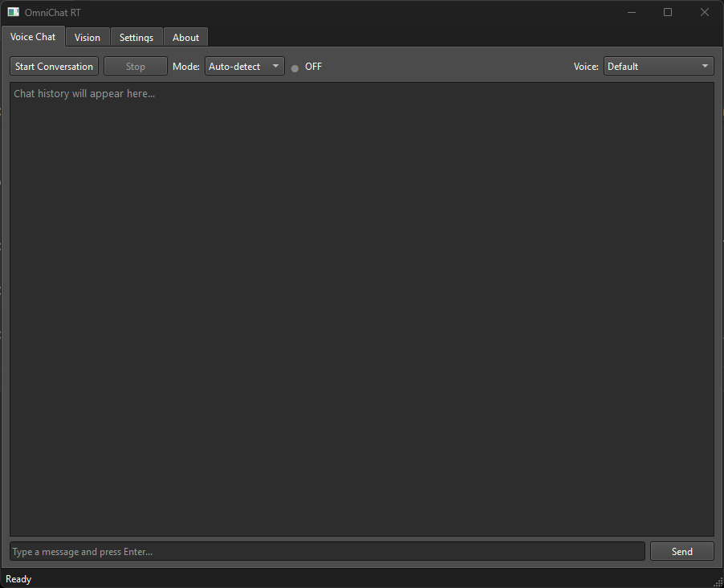

# OmniChat RT — Desktop App

Native PySide6 desktop client for OmniChat. Plays audio directly via sounddevice with ~200ms output latency, cutting first-audio time from ~5s (Gradio HLS) to ~1.5-2s.

Same model, same tools, same settings — just faster audio and a native UI.



## Why a Desktop App?

Gradio's streaming audio pipeline adds 4-8 seconds of latency:

| Step | Gradio (HLS) | Desktop (PCM) |
|------|--------------|---------------|
| Model generates chunk | ~100-200ms | ~100-200ms |
| Encode WAV to AAC | ~50-100ms | *skipped* |
| HLS segment buffering | 1-3s | *skipped* |
| Browser buffering | 2-4s | *skipped* |
| sounddevice output | — | ~10-30ms |
| **Total to speaker** | **~4-8s** | **~200ms** |

The desktop app sends raw PCM samples directly to the speaker via `sounddevice.OutputStream`. No transcoding, no browser, no buffering layer.

## Quick Start

```bash
cd OmniChat

# Windows — double-click or run:
launch_rt.bat

# Or manually:
.venv/Scripts/python.exe rt_main.py
```

A splash screen shows while the model loads (~30s first time, ~10s cached). The main window opens when the model is ready.

## Requirements

Same as the Gradio app — see [README.md](README.md#requirements). Additional dependency: `PySide6>=6.6` (included in `requirements.txt`).

Quantization works the same way:
```bash
launch_rt.bat --quantization int8   # ~10-12 GB VRAM
launch_rt.bat --quantization int4   # ~11 GB VRAM
```
See [README.md](README.md#quantization) for details, research citations, and important caveats about audio quality under quantization (text chat works fine; audio/speech output is untested and may need adjustments).

## Features

### Voice Chat

Real-time voice conversation with the same three interaction modes as the Gradio app:

| Mode | How It Works |
|------|-------------|
| **Auto-detect** (default) | Silero-VAD listens continuously. Silence after speech triggers inference. |
| **Push-to-talk** | Hold the PTT button to record, release to send. |
| **Click per turn** | Record after model responds, click to send. |

The state indicator shows the current conversation phase with color-coded dots:

- **Listening** (green) — mic active, waiting for speech
- **You're speaking** (blue) — VAD detected speech, buffering audio
- **Thinking** (yellow) — speech ended, model processing
- **Responding** (purple) — model streaming audio response
- **Ready** (orange) — response done, about to resume listening

**Text-only mode:** When the conversation is stopped (OFF state), typing in the text box and pressing Enter or Send gets a text-only response from the model — no audio generated or played. Start the conversation to get spoken responses.

**Voice switching:** Select a voice from the dropdown to use a cloned voice. The status bar confirms the active voice.

**Barge-in:** Start talking while the model is responding to interrupt it. The model stops generating and listens to your new input.

### Vision

**Image analysis** — upload any image (PNG, JPG, BMP, GIF, TIFF) and ask questions about it. Toggle Document/OCR mode for structured text extraction.

**Video analysis** — upload a video file (MP4, AVI, MOV, MKV, WEBM) for combined visual + audio analysis.

Both run on a background thread to keep the UI responsive. Results can be saved as Markdown, Text, or Excel.

### Voice Cloning

Voice samples are not included in the repo. Supply your own — **any common audio or video format works**, no pre-conversion needed:

- **From audio file:** Settings tab > Voice Management > name the voice, click "Add from WAV", pick a file. Accepts WAV, MP3, OGG, FLAC, M4A, and anything librosa can decode. Auto-resampled to 16kHz mono.
- **From video file:** Settings tab > "From Video Clip" — extracts the audio track. Accepts MP4, AVI, MOV, MKV, WebM, and anything ffmpeg can decode. Set start time and duration to select the right segment.
- **From a directory:** Drop voice files into your voices directory (default `voices/`, configurable via `audio.voices_dir` in settings or `--voices-dir` flag).

Delete voices from the Settings tab dropdown. Use 3-5 second clips for best results — longer clips increase parroting of the sample's content.

### Settings

All settings update in real-time during the session and are shared with the Gradio app via `args/settings.yaml`:

**Inference:** Temperature (0.0-1.5), max response tokens (128-8192), repetition penalty (1.0-2.0).

**Audio:** Voice sample length (1-30s) — controls how many seconds of the voice clip are sent for cloning. Shorter clips reduce echo/parroting artifacts.

**Conversation Mode:** Silence threshold (0.5-5.0s), VAD sensitivity (0.1-0.95), echo cooldown (0.0-10.0s), anti-vox boost (0.0-0.5), barge-in toggle.

### About Tab

Shows model name, GPU info (auto-detected), audio configuration, and VAD status.

## Architecture

### Threading Model

Four threads keep the UI responsive during GPU inference:

| Thread | Runs | Blocking? | Communication |
|--------|------|-----------|--------------|
| **Main/UI** | PySide6 event loop, VAD (<1ms) | No | Direct calls |
| **Audio input** | `sounddevice.InputStream` callback | No | Qt signal -> main |
| **Audio output** | `sounddevice.OutputStream` callback | No | `Queue.get_nowait()` |
| **Model inference** | `chat_streaming()` GPU ops | Yes (1-30s) | Qt signal -> main |

### Signal Flow

```
mic.chunk_received
  -> AudioPipeline._on_mic_chunk()
    -> ConversationManager.on_audio_chunk()    [Silero-VAD, <1ms on CPU]
    -> if speech complete: emit speech_ready
    -> if barge-in detected: stop inference + player

ModelInferenceThread.chunk_ready
  -> AudioPipeline._on_model_chunk()
    -> StreamingAudioPlayer.push(pcm_chunk)    [direct to sounddevice, ~10ms]
    -> emit text_update for chat display

ModelInferenceThread.finished_signal
  -> AudioPipeline._on_model_done()
    -> QTimer polls for audio drain (50ms interval)
    -> player.stop(), ConversationManager.on_model_done()
    -> anti-vox cooldown starts
```

### Audio Processing

Each chunk from the model goes through:

1. **Fade-in** (first chunk only) — 100ms ramp smooths vocoder cold-start artifact
2. **RMS normalization** — brings audio to consistent target level
3. **Direct PCM output** — numpy array pushed to `sounddevice.OutputStream` queue

No transcoding. No file I/O. The audio chunk goes from GPU to speaker in ~200ms.

### Anti-Vox Echo Suppression

After the model finishes speaking, the VAD threshold is temporarily raised by `antivox_boost` for `echo_cooldown_s` seconds. This prevents speaker output bleeding into the mic from triggering a new conversation turn. Only strong nearby speech (the user) gets through.

## Shared Codebase

The desktop app reuses 67% of OmniChat's code — the entire `tools/` layer:

| Module | What It Provides |
|--------|-----------------|
| `tools/model/model_manager.py` | Model singleton, `chat_streaming()` generator |
| `tools/audio/conversation.py` | VAD state machine, 3 interaction modes |
| `tools/audio/streaming_player.py` | Queue-based PCM playback via sounddevice |
| `tools/audio/voice_manager.py` | Voice lookup with fuzzy matching |
| `tools/audio/extract_voice.py` | Extract audio from video via ffmpeg |
| `tools/vision/process_media.py` | Image/document/video analysis |
| `tools/output/save_output.py` | Save as Markdown, Text, or Excel |
| `tools/shared/session.py` | Settings loader, voice commands, audio normalization |

Desktop-specific code is three files:

| File | Lines | Purpose |
|------|-------|---------|
| `rt_main.py` | ~100 | Entry point, model loading splash screen |
| `rt_app.py` | ~710 | QMainWindow with 4 tabs, all UI logic |
| `rt_audio.py` | ~320 | MicInputStream, ModelInferenceThread, AudioPipeline |

## Testing

```bash
cd OmniChat

# RT audio pipeline tests (mock-based, no GPU or audio hardware)
.venv/Scripts/python.exe -m pytest tests/test_rt_audio.py -v

# Shared session helper tests
.venv/Scripts/python.exe -m pytest tests/test_session.py -v

# Full unit test suite (270 tests, ~4s)
.venv/Scripts/python.exe -m pytest tests/ -v -m "not gpu"
```

All RT tests are mock-based — no GPU, no audio hardware, no PySide6 event loop required.

## Configuration

Shares `args/settings.yaml` with the Gradio app. See [README.md](README.md#configuration) for the full settings reference.

## Limitations

- **Windows only** — tested on Windows 11. Linux should work but is untested.
- **Single GPU** — only one app (Gradio or Desktop) can use the model at a time.
- **No voice commands by speech** — voice commands ("switch to Morgan Freeman") must be typed, not spoken. The audio goes directly to the model without a transcription step.
- **No remote access** — runs locally only. Use the Gradio app for remote/shared access.
