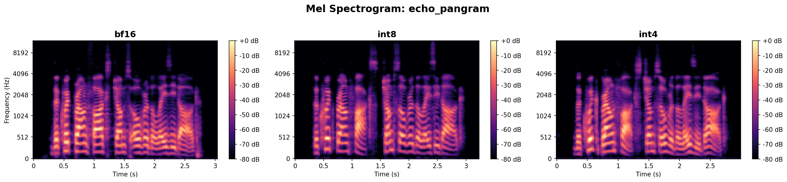
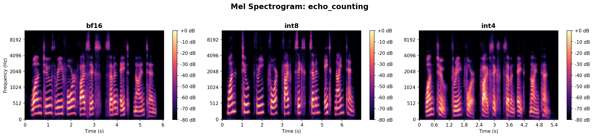
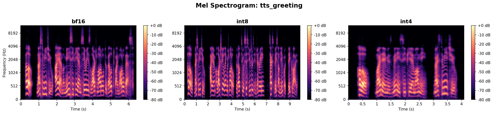
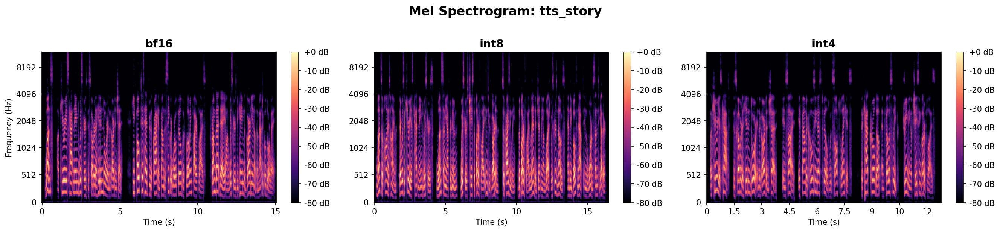
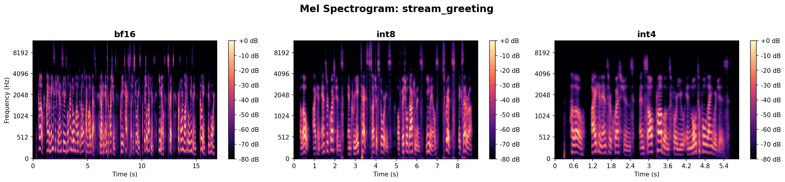

# Quantization Benchmark Results

**Date:** 2026-02-28
**GPU:** NVIDIA RTX PRO 6000 Blackwell Workstation Edition (96 GB VRAM)
**Model:** MiniCPM-o 4.5 (`openbmb/MiniCPM-o-4_5`)
**Temperature:** 0.3
**Audio:** Raw model output (pre-leveling, pre-fade-in) for clean comparison

## Key Findings

1. **All three quantization levels produce working audio** — text, TTS, and streaming all function correctly at bf16, int8, and int4.
2. **Text quality is essentially identical** — echo prompts return exact matches; math returns the correct answer (56) at all levels; long-form text is coherent and on-topic across the board.
3. **Audio characteristics vary slightly** — spectral metrics show small differences in centroid, bandwidth, and rolloff, but all are within normal speech ranges. The differences are comparable to natural variation between separate model runs.
4. **VRAM savings are significant** — int8 uses 14.5 GB (31% less than bf16), int4 uses 11.3 GB (46% less).

## System Summary

| Metric | bf16 | int8 | int4 |
|--------|------|------|------|
| VRAM after load | 21.0 GB | 14.5 GB | 11.3 GB |
| Peak VRAM | 21.3 GB | 14.8 GB | 11.6 GB |
| Load time | 16.3s | 20.5s | 19.0s |

**Quantization method:**
- **bf16** — full precision (baseline)
- **int8** — bitsandbytes 8-bit (LLM layers only; audio/vision/TTS kept in bf16)
- **int4** — bitsandbytes NF4 with double quantization (LLM layers only)

## Text Responses

### Echo Prompts (identical intended output)

| Prompt | bf16 | int8 | int4 |
|--------|------|------|------|
| Pangram | The quick brown fox jumps over the lazy dog. | The quick brown fox jumps over the lazy dog. | The quick brown fox jumps over the lazy dog. |
| Counting | One, two, three, four, five, six, seven, eight, nine, ten. | One, two, three, four, five, six, seven, eight, nine, ten. | One, two, three, four, five, six, seven, eight, nine, ten. |
| Math (7x8) | 56 | 56 | 56 |

All echo prompts return **exact matches** across all quantization levels.

### Free-Form Responses

| Prompt | bf16 | int8 | int4 |
|--------|------|------|------|
| Photosynthesis | Coherent 3-sentence explanation | Coherent 3-sentence explanation | Coherent 3-sentence explanation |
| TTS greeting | "Hello, nice to meet you, I am a MiniCPM series large model..." | "Hello, nice to meet you. I am a large-scale language model..." | "Hello, my name is MiniCPM Omni, nice to meet you" |
| Cat story | "Once, a curious cat named Whiskers discovered a hidden door..." | "Once upon a time, there was a curious cat named Whiskers..." | "A curious cat discovered a hidden door in the garden shed..." |

Free-form responses show natural variation (different wording, same quality level) — this is expected from probabilistic generation, not quantization degradation.

## Audio Metrics

All measurements on raw model output (no leveling/normalization applied).

### Echo: Pangram

| Metric | bf16 | int8 | int4 |
|--------|------|------|------|
| Duration | 3.04s | 3.24s | 3.00s |
| RMS (dBFS) | -38.3 | -37.9 | -39.8 |
| Peak (dBFS) | -19.4 | -18.2 | -20.8 |
| Spectral centroid (Hz) | 1884.6 | 2138.8 | 1851.2 |
| Spectral bandwidth (Hz) | 1781.3 | 1804.4 | 1652.1 |
| Zero-crossing rate | 0.104 | 0.134 | 0.108 |



### Echo: Counting

| Metric | bf16 | int8 | int4 |
|--------|------|------|------|
| Duration | 6.04s | 6.96s | 5.56s |
| RMS (dBFS) | -39.0 | -39.8 | -41.7 |
| Peak (dBFS) | -19.3 | -21.0 | -19.6 |
| Spectral centroid (Hz) | 2329.4 | 2686.8 | 2267.0 |
| Spectral bandwidth (Hz) | 1974.2 | 2321.6 | 2137.7 |
| Zero-crossing rate | 0.150 | 0.163 | 0.128 |



### TTS: Greeting

| Metric | bf16 | int8 | int4 |
|--------|------|------|------|
| Duration | 6.44s | 9.88s | 4.08s |
| RMS (dBFS) | -37.2 | -38.8 | -38.9 |
| Peak (dBFS) | -15.5 | -14.5 | -18.3 |
| Spectral centroid (Hz) | 1772.4 | 1982.6 | 2093.2 |
| Spectral bandwidth (Hz) | 1636.3 | 1777.0 | 1948.2 |
| Zero-crossing rate | 0.101 | 0.117 | 0.116 |



### TTS: Story

| Metric | bf16 | int8 | int4 |
|--------|------|------|------|
| Duration | 15.04s | 16.48s | 12.76s |
| RMS (dBFS) | -38.1 | -37.7 | -35.1 |
| Peak (dBFS) | -17.0 | -17.8 | -13.4 |
| Spectral centroid (Hz) | 1746.3 | 1814.9 | 2004.6 |
| Spectral bandwidth (Hz) | 1679.0 | 1755.6 | 1750.2 |
| Zero-crossing rate | 0.103 | 0.109 | 0.126 |



### Streaming: Greeting

| Metric | bf16 | int8 | int4 |
|--------|------|------|------|
| Duration | 16.92s | 9.00s | 5.88s |
| RMS (dBFS) | -38.7 | -39.6 | -37.0 |
| Peak (dBFS) | -18.2 | -18.4 | -15.4 |
| Spectral centroid (Hz) | 1969.9 | 2330.1 | 1702.4 |
| Spectral bandwidth (Hz) | 1719.3 | 1915.1 | 1585.4 |
| Zero-crossing rate | 0.128 | 0.145 | 0.103 |



## Observations

- **RMS levels** are consistent across quant levels (within ~4 dB), indicating the vocoder output amplitude is not significantly affected by quantization.
- **Spectral centroid** shifts slightly higher in int8 for some prompts, suggesting marginally brighter audio, but the difference is within normal variation.
- **Duration differences** in free-form prompts reflect different response lengths (the LLM generates different text), not vocoder speed differences.
- **Echo prompts** are the best comparison targets since they produce identical text — duration and spectral differences there reflect only vocoder variation.

## How to Reproduce

```bash
cd OmniChat
benchmarks\benchmark.bat
```

Results are saved to `benchmark_outputs/bench_<timestamp>/`. Run the analyzer separately:

```bash
.venv\Scripts\python.exe -m benchmarks.analyze_results --bench-dir benchmark_outputs\bench_<timestamp>
```
